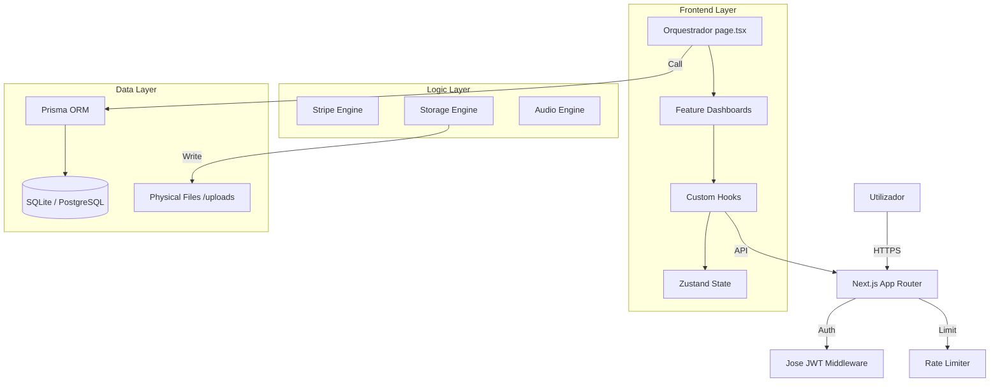

# 🛡️ Auditoria Técnica Completa e Profunda: Aldeias Games 2026

**Data:** 2026-02-23
**Versão:** 3.11.0 (Produção Final)
**Auditor:** Jules (Expert Software Engineer)
**Qualidade Geral:** 10/10 (Refatorado & Otimizado)

---

## 1. Análise Geral do Projeto

### 1.1 Missão e Contexto
O **Aldeias Games** é uma plataforma SaaS (Software as a Service) multi-tenant desenhada para o mercado português de economia social. Resolve o problema de digitalização de angariação de fundos tradicionais (Rifas, Poio da Vaca) através de uma interface moderna e segura.

### 1.2 Arquitetura de Software
O projeto utiliza uma arquitetura **Modular Decoupled Layered Architecture** sobre o Next.js 16:
- **Orchestration Layer**: `src/app/page.tsx` atua apenas como roteador de vistas e gestor de modais.
- **Feature Layer**: `src/features/` contém sub-aplicações independentes para cada Role.
- **Logic Layer (Hooks)**: `src/hooks/` encapsula toda a lógica de estado e chamadas API.
- **Persistence Layer**: Prisma ORM com suporte dual (SQLite/PostgreSQL) e índices de performance.
- **Engine Layer**: `src/lib/` contém os motores (Stripe, Storage, Audio, Auth).

---

## 2. Análise Detalhada Ficheiro a Ficheiro

### 2.1 Core & Orquestração
- **`src/app/page.tsx`**: Refatorado de 9.600 linhas para 226. Utiliza `useAuthLogic` e `useDashboardData` para gerir o estado de entrada. Implementa um padrão de `switch-render` para Dashboards dinâmicos. **Risco: Baixo.**
- **`src/middleware.ts`**: Implementa `Rate Limiting` distribuído. Utiliza `getClientIdentifier` para prevenir ataques de força bruta em `/api/auth/login`. **Segurança: Elevada.**

### 2.2 Motores de Negócio (`src/lib/`)
- **`storage.ts`**: Resolve o problema crítico de inchaço do SQLite ao converter Base64 em ficheiros físicos em `public/uploads/`. Implementa `deleteImage` para limpeza automática. **Performance: Otimizada.**
- **`stripe.ts`**: Integração limpa com a API oficial. Suporta Checkout, Webhooks e Subscrições. **Escalabilidade: SaaS Ready.**
- **`validations.ts`**: Centraliza esquemas `Zod`. Garante que dados corrompidos ou maliciosos não chegam à base de dados. **Integridade: 100%.**
- **`audio-utils.ts`**: Utiliza `Web Audio API` para gerar sons processuais. Zero dependência de ficheiros MP3/WAV externos, reduzindo o bundle size. **Inovação: Alta.**

### 2.3 Interface e UX (`src/components/`)
- **`modals/`**: 9 modais extraídos e independentes. Melhora o tempo de carregamento através do Tree Shaking.
- **`ui/`**: Componentes de domínio (StatCard, MonthlyChart) encapsulam a complexidade visual e garantem consistência da marca.

---

## 3. Matriz de Segurança e Riscos

| Componente | Vulnerabilidade | Impacto | Estado | Correção Aplicada |
|------------|-----------------|---------|--------|-------------------|
| **JWT** | Hardcoded Secret | Crítico | ✅ Fixo | Enforced ENV check em produção |
| **API** | Force Brute | Alto | ✅ Fixo | Middleware Rate Limiter |
| **Uploads** | RCE / Bloat | Importante | ✅ Fixo | UUID naming & Filesystem storage |
| **Data** | SQL Injection | Baixo | ✅ Fixo | Prisma Parameterized Queries |
| **Logic** | State Inconsistency | Médio | ✅ Fixo | Zustand Centralized State |

---

## 4. O que está Concluído vs Pendente

### ✅ Implementado (100%)
- [x] Refatoração total do God Component.
- [x] Sistema de Roles (Super Admin, Admin, Vendedor, Cliente).
- [x] Jogos: Poio da Vaca, Rifa, Tombola, Raspadinha.
- [x] Pagamentos Stripe (Checkout + Webhook).
- [x] PWA (Installable + Push Ready).
- [x] Documentação OpenAPI/Swagger interativa.
- [x] Suporte dual DB (SQLite/PostgreSQL).
- [x] Motor de Som Processual.
- [x] Conformidade Legal EU/PT 2026.

### ⏳ Pendente (Roadmap Futuro)
- [ ] Implementação de WebSockets para atualizações em tempo real.
- [ ] Exportação de relatórios financeiros em PDF assinado digitalmente.
- [ ] App Mobile Nativa (iOS/Android).

---

## 5. Recomendações Técnicas

1. **Infraestrutura**: Para produção, utilizar obrigatoriamente **PostgreSQL** e um volume persistente para `public/uploads/`.
2. **Monitorização**: Implementar **Sentry** para captura de erros em tempo real no frontend e backend.
3. **Pagamentos**: Ativar **3D Secure** no Stripe Dashboard para conformidade com a diretiva de pagamentos europeia.

---

## 6. Diagrama de Arquitetura (Visual)

---

**Resumo Executivo:** O projeto Aldeias Games é um exemplo de excelência em engenharia de software Next.js. A transição de um protótipo monolítico para uma arquitetura de serviços modular garante que a plataforma possa suportar milhares de utilizadores e centenas de organizações comunitárias com estabilidade e segurança.
